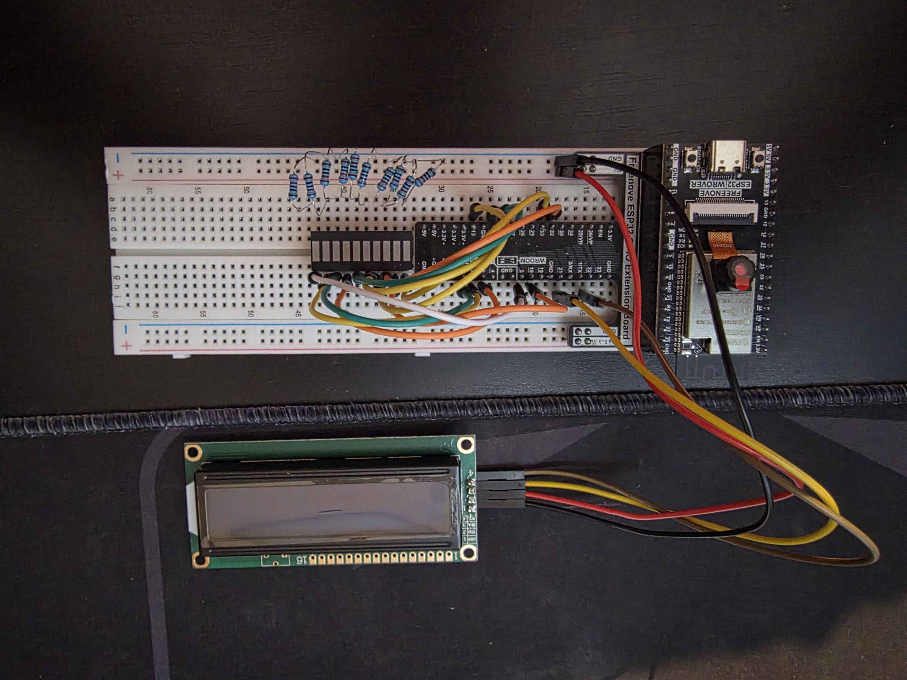
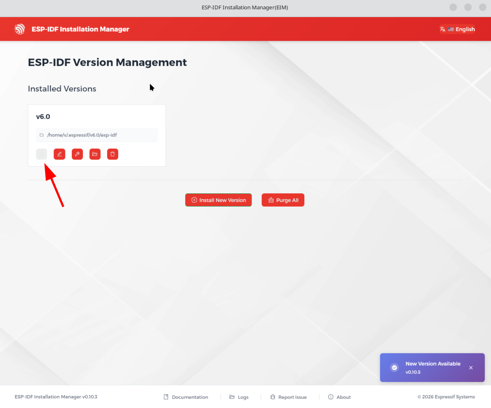
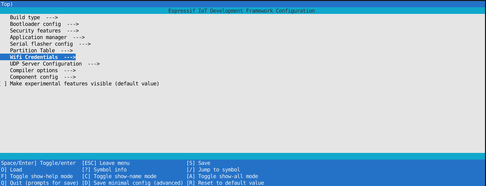
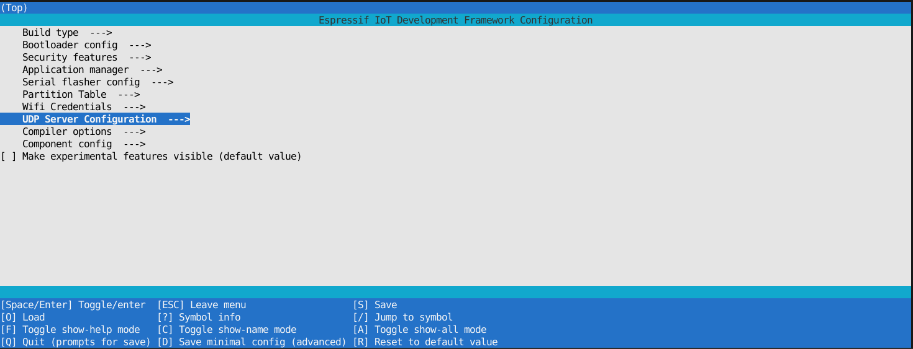

# Racing Sim LCD Display

## Synopsis
The goal of this project is to visualize streamed data from games such as F1-25 and DiRT Rally 2.0 to different peripherals such as an I2C LCD display and LED strip hooked up to my ESP32 Wrover MCU.
It will display simple telemtry data such as the RPM, current gear, speed, and current lap time.

## Board Layout

## Components
- [ESP32 Wrover MCU](https://store.freenove.com/products/fnk0060)
- [1602 I2C LCD Display](https://www.amazon.ca/backlight-control-character-compatible-applications/dp/B0G6F8L91N?th=1)
- [LED bar graph display](https://www.digikey.ca/en/products/detail/kingbright/DC10YWA/1747578)

## Setup
I am using the new `ESP-IDF Installation Manager (eim)` GUI software provided by Espressif to initialize the base `esp` repository and provide the necessary libraries.  

Within the tool, I press the 'open console' button which opens a terminal that has the PATH variables set for the esp-idf commands using `idf.py`.  

Within the terminal, I run the following commands:
1. Create Project: `idf.py create-project sim_lcd_display && cd sim_lcd_display`
2. Set the target: `idf.py set-target esp32`
3. Configure params: `idf.py menuconfig` (see [Kconfig Parameters](#kconfig-parameters))

### Kconfig Parameters
There are some parameters to configure to setup Wifi for the UDP server.  

**"Wifi Config"**:  
- `WIFI_SSID`: The SSID of your Wifi  
- `WIFI_PASSWORD`: The password for your Wifi  

- `PORT`: The port to listen on for the UDP server (should match the port you configured in your game settings)  
- `GAME`: The game to configure the UDP packet parsing for (currently DiRT Rally 2.0)
    - 1 = DiRT Rally 2.0, 2 - etc  

## Compilation

1. Build: `idf.py build`
2. Flash & Run: `idf.py -p PORT flash`, where `PORT` is the `/dev/tty` device that the board shows up as (should be similar to `/dev/ttyUSB0`)

>[!NOTE]
> Need to add user to dialout in order to flash board: `sudo usermod -a -G dialout $USER` (logout and back in after running command)  

## Component Setup

### LCD Display
I am using the [1602 I2C LCD Display](https://www.handsontec.com/dataspecs/module/I2C_1602_LCD.pdf)  

The docs for integrating the I2C peripheral can be found [here](https://docs.espressif.com/projects/esp-idf/en/stable/esp32/api-reference/peripherals/lcd/index.html)  

None of the third-party dependencies were working properly so I have written my own "driver" for the LCD screen to be able to easily control it. Since the LCD module I have has the I2C backpack, the LCD library controls the display by creating bytes to send from the backpack to the display.   

I currently have the pins mapped accordingly:
- `VCC` → `5V`
- `GND` → `GND`
- `SDA` → `GPIO21`
- `SCL` → `GPIO22`
>[!NOTE]
> I need to make these Kconfig params

### LED Bar Graph
Fairly simple to configure, only requires 220 Ohm resistors to GND for each LED bar.  

I have the LED's mapped to these pins (Bar 1 is leftmost bar and so on):
- `Bar 1` → `GPIO_NUM_33`
- `Bar 2` → `GPIO_NUM_18`
- `Bar 3` → `GPIO_NUM_32`
- `Bar 4` → `GPIO_NUM_13`
- `Bar 5` → `GPIO_NUM_12`
- `Bar 6` → `GPIO_NUM_14`
- `Bar 7` → `GPIO_NUM_0`
- `Bar 8` → `GPIO_NUM_15`
- `Bar 9` → `GPIO_NUM_2`
- `Bar 10` → `GPIO_NUM_5`
>[!NOTE]
> I need to make these Kconfig params

## Notes

See [NOTES.md](./NOTES.md) for my rough notes when working on this.